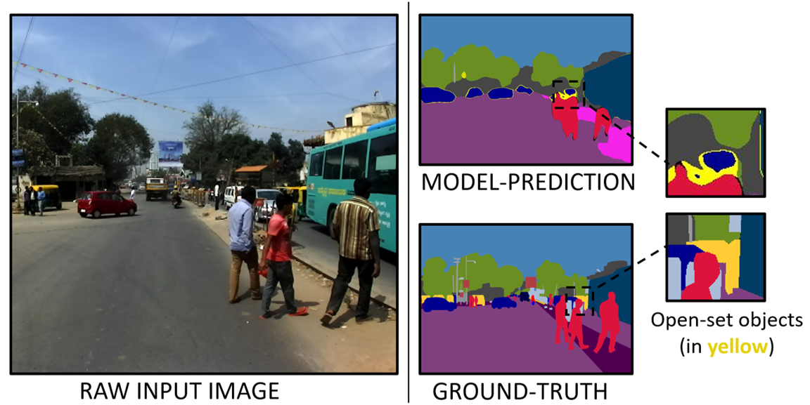
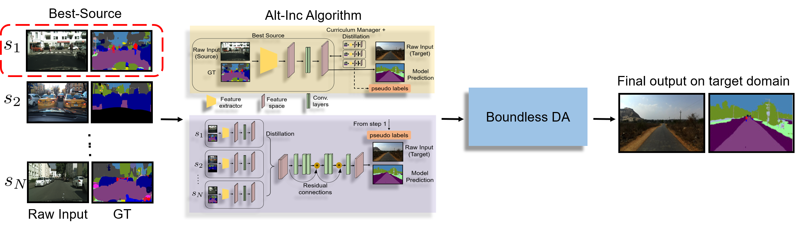

### Paper - [**BoMuDA: Boundless Multi-Source Domain Adaptive Segmentation in Unstructured Environments**](https://arxiv.org/abs/2010.03523)

Project Page - https://gamma.umd.edu/bomuda

Please cite our paper if you find it useful.

```
@article{kothandaraman2020bomuda,
  title={BoMuDA: Boundless Multi-Source Domain Adaptive Segmentation in Unconstrained Environments},
  author={Kothandaraman, Divya and Chandra, Rohan and Manocha, Dinesh},
  journal={arXiv preprint arXiv:2010.03523},
  year={2020}
}
```

<p align="center">

</p>

Table of Contents
=================

  * [Paper - <a href="https://arxiv.org/abs/2010.03523" rel="nofollow"><strong>BoMuDA: Boundless Multi-Source Domain Adaptive Segmentation in Unstructured Environments</strong></a>](#paper---BoMuDA-Boundless-Multi-Source-Domain-Adaptive-Segmentation-in-Unstructured-Environments)
  * [**Repo Details and Contents**](#repo-details-and-contents)
     * [Code structure](#code-structure)
     * [Datasets](#datasets)
     * [Dependencies](#dependencies)
  * [**Our network**](#our-network)
  * [**Acknowledgements**](#acknowledgements)

## Repo Details and Contents
Python version: 3.7

### Code structure
'dataset' folder - contains dataloaders, list of train and validation images
'model' folder - contains code for the network architectures
'utils' folder - additional functions
eval_idd_openset.py - evaluation script for IDD, for the overall algorithm
eval_idd_ensemble.py - evaluation script for model outputs ensembled from step 1 and step 2
train_singlesourceDA.py - training script for single source DA
train_bddbase_multi3source_furtheriterations.py - training script for step 1 
train_multi3source_combinedbddbase.py - training script for step 2
train_openset.py - training script for boundless DA module

### Datasets
* [**India Driving Dataset**](https://idd.insaan.iiit.ac.in/) 
* [**CityScapes**](https://www.cityscapes-dataset.com/) 
* [**Berkeley Deep Drive**](https://bdd-data.berkeley.edu/) 
* [**GTA5**](https://download.visinf.tu-darmstadt.de/data/from_games/) 
* [**SynScapes**](https://7dlabs.com/synscapes-overview) 

### Dependencies
pytorch
numpy
scipy
matplotlib

## Our network

<p align="center">

</p>

## Acknowledgements

This code is heavily borrowed from [**AdaptSegNet**](https://github.com/wasidennis/AdaptSegNet)
