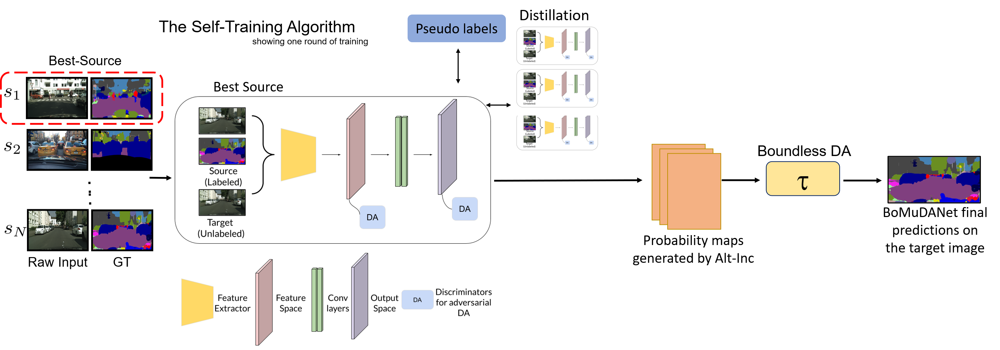

### Paper - [**BoMuDANet: Unsupervised Adaptation for Visual Scene Understanding in Unstructured Driving Environments**](https://arxiv.org/abs/2010.03523)

Project Page - https://gamma.umd.edu/researchdirections/autonomousdriving/bomuda/ 

Watch the video [*here*](https://youtu.be/2TQ9lwohGos)

Please cite our paper if you find it useful.

```
@article{kothandaraman2020bomuda,
  title={BoMuDA: Boundless Multi-Source Domain Adaptive Segmentation in Unconstrained Environments},
  author={Kothandaraman, Divya and Chandra, Rohan and Manocha, Dinesh},
  journal={arXiv preprint arXiv:2010.03523},
  year={2020}
}
```

Table of Contents
=================
 * [Paper - <a href="link to paper" rel="nofollow"><strong>BoMuDANet: Unsupervised Adaptation for Visual Scene Understanding
in Unstructured Driving Environments</strong></a>](#paper---BoMuDANet-Unsupervised-Adaptation-for-Visual-Scene-Understanding-in-Unstructured-Driving-Environments)
  * [**Repo Details and Contents**](#repo-details-and-contents)
     * [Code structure](#code-structure)
     * [Training your own model](#training-your-own-model)
     * [Datasets](#datasets)
     * [Dependencies](#dependencies)
  * [**Our network**](#our-network)
  * [**Acknowledgements**](#acknowledgements)

## Repo Details and Contents
Python version: 3.7

### Code structure
#### Dataloaders <br>
|Dataset|Dataloader|List of images|
|-----|-----|-----|
|CityScapes|dataset/cityscapes.py|dataset/cityscapes_list|
|India Driving Dataset| dataset/idd_dataset.py,idd_openset.py | dataset/idd_list|
|GTA | dataset/gta_dataset.py | dataset/gta_list |
|SynScapes | dataset/synscapes.py | dataset/synscapes_list |
|Berkeley Deep Drive | dataset/bdd/bdd_source.py | dataset/bdd_list |

### Our network
<p align="center">

</p>

### Training your own model

**Stage 1**: Train networks for single source domain adaptation on various source-target pairs. <br>
```
python train_singlesourceDA.py
```
**Stage 2**: Use the trained single-source networks, and the corresponding domain discriminators for multi-source domain adaptation.
```
python train_bddbase_multi3source_furtheriterations.py
```
**Evaluation (closed-set DA)**: 
```
python eval_idd_BoMuDA.py
```
**Evaluation (open-set DA)**: 
```
python eval_idd_openset.py
```
 
Make sure to set appropriate paths to the folders containing the datasets, and the models in the training and evaluation files. <br>

### Datasets
* [**Clear weather: CityScapes**](https://www.cityscapes-dataset.com/) 
* [**India Driving Dataset**](https://idd.insaan.iiit.ac.in/)  
* [**GTA5**](https://download.visinf.tu-darmstadt.de/data/from_games/)
* [**SynScapes**](https://7dlabs.com/synscapes-overview)
* [**Berkeley Deep Drive**](https://bdd-data.berkeley.edu/) 


### Dependencies
PyTorch <br>
NumPy <br>
SciPy <br>
Matplotlib <br>

## Acknowledgements

This code is heavily borrowed from [**AdaptSegNet**](https://github.com/wasidennis/AdaptSegNet).
